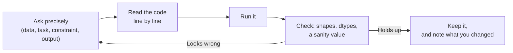

# Class 1 · Data and Decision Making + Your Coding Setup

📅 Friday 11 September 2026
⏱️ 13:00 – 16:00
Block A · Data
✅ Already taught

!!! success "Session recap"
    This page documents what we covered in the first session, so you can review it before Class 2.
    If you missed it, work through the notebook and the setup steps below — Class 2 assumes both.

## 🎯 Objectives

- Distinguish the types of data you will meet in business problems, and what each type allows you to model.
- Recognise how the data type constrains the method (and the metric) you can use later.
- Have a working coding environment: **VS Code + Python + an AI coding assistant**.
- Run a first prompt-and-verify cycle: ask the assistant for code, read it, run it, check it.

## 🗓️ Agenda (3 hours)

| Time | Block |
|---|---|
| 13:00 – 13:20 | Course overview: two projects, no exams, and why the assistant thread matters |
| 13:20 – 14:15 | Types of data: nominal, ordinal, discrete, continuous, text, dates |
| 14:15 – 14:30 | Break |
| 14:30 – 15:20 | Setting up VS Code, Python and your assistant |
| 15:20 – 15:55 | First prompt-and-verify cycle on a small dataset |
| 15:55 – 16:00 | Wrap-up and homework |

## 📖 What we covered

### 1. Types of data and why they matter

Every modelling decision downstream depends on what kind of variable you are holding:

| Type | Examples | What it lets you do | Typical mistake |
|---|---|---|---|
| **Nominal** | Region, contract type | Group, count, one-hot encode | Treating codes (1, 2, 3) as numbers |
| **Ordinal** | Risk rating, satisfaction 1–5 | Order, rank | Assuming equal spacing between levels |
| **Discrete** | Number of claims, visits | Count models, most ML methods | Modelling counts as continuous without thought |
| **Continuous** | Price, income, tenure | Full numeric toolbox | Ignoring skew and outliers |
| **Text** | Reviews, tickets | Needs encoding before modelling | Feeding raw strings to a model |
| **Date/time** | Purchase date | Derive features; respect time order | Random splits on time-dependent data |

> 💡 The question "what type is this variable?" is the cheapest error-prevention tool in the course.
> Ask it before you model, not after the results look strange.

### 2. Your coding setup

We installed and checked:

- **VS Code** with the Python and Jupyter extensions.
- **Python** with `pandas`, `numpy`, `matplotlib`, `scikit-learn` (local environment or Colab).
- **An AI coding assistant** in the editor — Copilot, Claude, Gemini or Cursor. See
  [Code Assistants](../code-assistants.md) for setup details and the course policy.

### 3. The prompt-and-verify cycle

The habit we start in this course, and repeat every session:

## 📓 Notebook

[📓 Class 1 — Types of Data](../notebooks/class1.ipynb) ·

## ✍️ Before Class 2

- [ ] Make sure your environment runs the Class 1 notebook end to end.
- [ ] Have your assistant working **inside the editor**, not only in a browser tab.
- [ ] Complete [Homework 1 — Python basics](../homeworks/Python_Basics_Homework.ipynb)
      ([Colab](https://colab.research.google.com/github/hizocar/machine_learning_egei/blob/main/docs/homeworks/Python_Basics_Homework.ipynb)).
      Do it yourself first, then ask the assistant to review it.
- [ ] Read the [Code Assistants](../code-assistants.md) page — the verification checklist is used in
      every session from now on.
