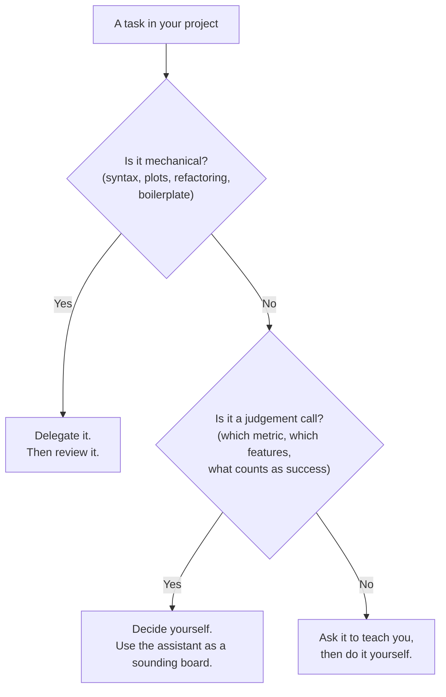

# 🤖 Working with a Code Assistant

<div class="usm-session-meta">
<span>🧵 Transversal thread of the course</span>
<span class="usm-tag-gold">Required in both projects</span>
</div>

An AI coding assistant will write most of the syntax you need this term. That is fine — it is how
data teams work now. What it does **not** do is take responsibility for the result. This page is the
working agreement for that: how to set it up, how to ask well, how to verify, and what you must
disclose.

## 1. Pick one and set it up

Any of these is acceptable. Free tiers are enough for everything we do.

| Tool | Where it lives | Good for | Setup |
|---|---|---|---|
| **GitHub Copilot** | Inside VS Code / JetBrains | Inline completion while you type | Free for students via [GitHub Education](https://github.com/education) |
| **Claude** | Web chat, or in an editor | Explaining and reviewing longer code and notebooks | [claude.ai](https://claude.ai) |
| **ChatGPT** | Web chat; Advanced Data Analysis runs code | Exploring a dataset end to end in one conversation | [chatgpt.com](https://chatgpt.com) |
| **Gemini** | Web chat; also inside Colab | Working directly in a Colab notebook | [gemini.google.com](https://gemini.google.com) |
| **Cursor** | A full editor | Refactoring across several files | [cursor.com](https://cursor.com) |

!!! tip "If you work in Google Colab"
    Colab has an assistant built in, so you need no local setup at all. That is the lowest-friction
    path for this course, and it is the one we will use in class.

## 2. Ask well: four things every prompt needs

A vague prompt produces code that runs and answers the wrong question. Include:

| Element | Bad | Good |
|---|---|---|
| **Data** | "my dataframe" | "`df` with columns `customer_id`, `tenure_months`, `churn` (0/1); 8.000 rows" |
| **Task** | "do a model" | "fit a logistic regression predicting `churn`, with a stratified 80/20 split" |
| **Constraint** | — | "use scikit-learn only; no additional installs; set `random_state=42`" |
| **Output** | — | "return a function `train_model(df) -> (model, metrics_dict)` plus the ROC curve" |

!!! example "A prompt that works"
    ```text
    I have a pandas DataFrame `df` with columns: customer_id, tenure_months, monthly_charges,
    contract_type (categorical), churn (0/1). 8,000 rows, ~26% churn.

    Write a scikit-learn pipeline that:
    1. one-hot encodes contract_type and scales the numeric columns,
    2. fits a logistic regression predicting churn,
    3. evaluates it with stratified 5-fold cross-validation, reporting ROC-AUC and recall,
    4. returns the fitted pipeline and a dict of metrics.

    Use random_state=42. Do the encoding inside the pipeline, not before the split.
    Explain in two lines why that last point matters.
    ```

The final instruction — *explain why* — is what turns the assistant from a code vending machine into
a tutor. Use it constantly.

## 3. Verify before you trust

Generated code usually runs. Running is not the same as being correct. Before you keep any block:

- [ ] **Read it line by line.** If you cannot say what a line does, ask the assistant to explain it.
- [ ] **Check the shapes.** `df.shape`, `y.value_counts()`, `X_train.shape` — after every transformation.
- [ ] **Look for leakage.** Was anything fitted (scaler, encoder, imputer, feature selection) *before*
      the train/test split, or using the target?
- [ ] **Sanity-check the metric.** 99% accuracy on an imbalanced problem usually means the model
      predicts the majority class. Check recall, a confusion matrix, or a baseline.
- [ ] **Verify the API exists.** Assistants occasionally invent function arguments. If an argument
      looks unfamiliar, check the library documentation.
- [ ] **Re-run from a clean kernel.** "Restart and run all" — if the notebook does not reproduce, it
      is not finished.

### Failure modes we will see in this course

| Failure mode | What it looks like | How to catch it |
|---|---|---|
| **Data leakage** | Suspiciously high test score | Check what was fitted before the split |
| **Wrong metric** | Great accuracy, useless model | Look at the confusion matrix and the business cost of each error |
| **Fabricated API** | `TypeError: unexpected keyword argument` | Check the library docs |
| **Silent type coercion** | Numbers become strings; means look wrong | `df.dtypes` after every load and merge |
| **Plausible nonsense** | A confident explanation that is simply wrong | Ask for the source; test the claim on a small example |
| **Hidden randomness** | Different results on each run | Set `random_state` everywhere |

## 4. What to delegate — and what not to



Delegate: syntax you have written a hundred times, plotting, docstrings, refactoring, translating an
idea into library calls, and explaining an error message.

Do not delegate: choosing the target variable, deciding what counts as a good result, judging whether
a feature would be available at prediction time, or interpreting what a result means for the business.
Those are the parts you are being graded on.

## 5. Course policy

!!! warning "Allowed, expected, and disclosed"
    1. **Using an assistant is permitted and encouraged** in homework and in both projects.
    2. **You must be able to explain every line you submit.** Project presentations include questions
       about your own code. Code you cannot explain is treated as code you did not write.
    3. **You must disclose** your use in the assistant log of each project (next section).
    4. **Never paste confidential or personal data** into a public assistant. Use synthetic or public
       data in this course.

### The assistant log (required in both projects)

Half a page, at the end of the report. One row per meaningful use:

| Task | Tool | What it produced | What I changed or rejected |
|---|---|---|---|
| Build the preprocessing pipeline | Claude | Full `ColumnTransformer` | Moved the imputer inside the pipeline — it was leaking |
| Plot ROC curves | Copilot | Plot function | Kept as-is |
| Explain class weights | ChatGPT | Explanation + example | Used the idea, rewrote the code myself |

A log that says "we used it for everything and changed nothing" is a weak log: it means nobody
reviewed the work. A log with rejections in it is a strong one.

> 📈 **Why this is graded.** In a data team, the person who cannot defend their model does not get
> to deploy it. This course grades the same thing: your judgement about the code, not your speed at
> producing it.
